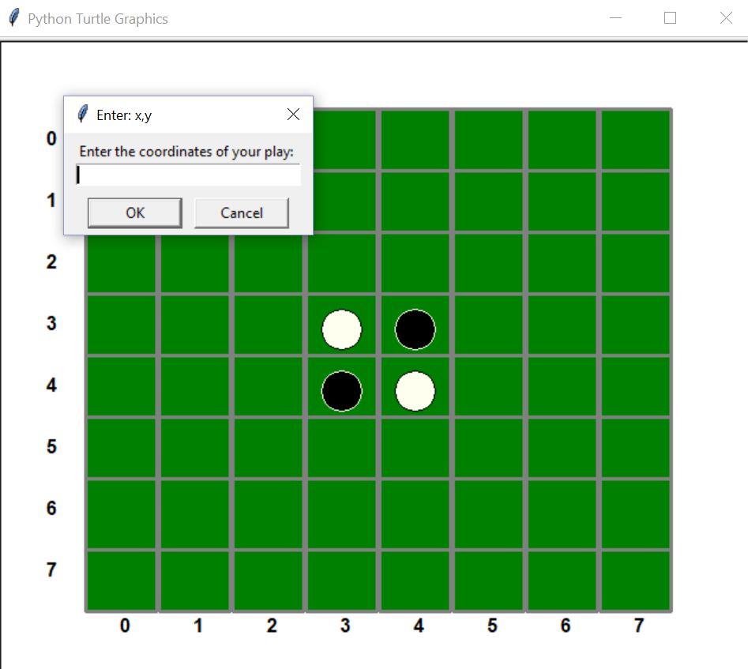
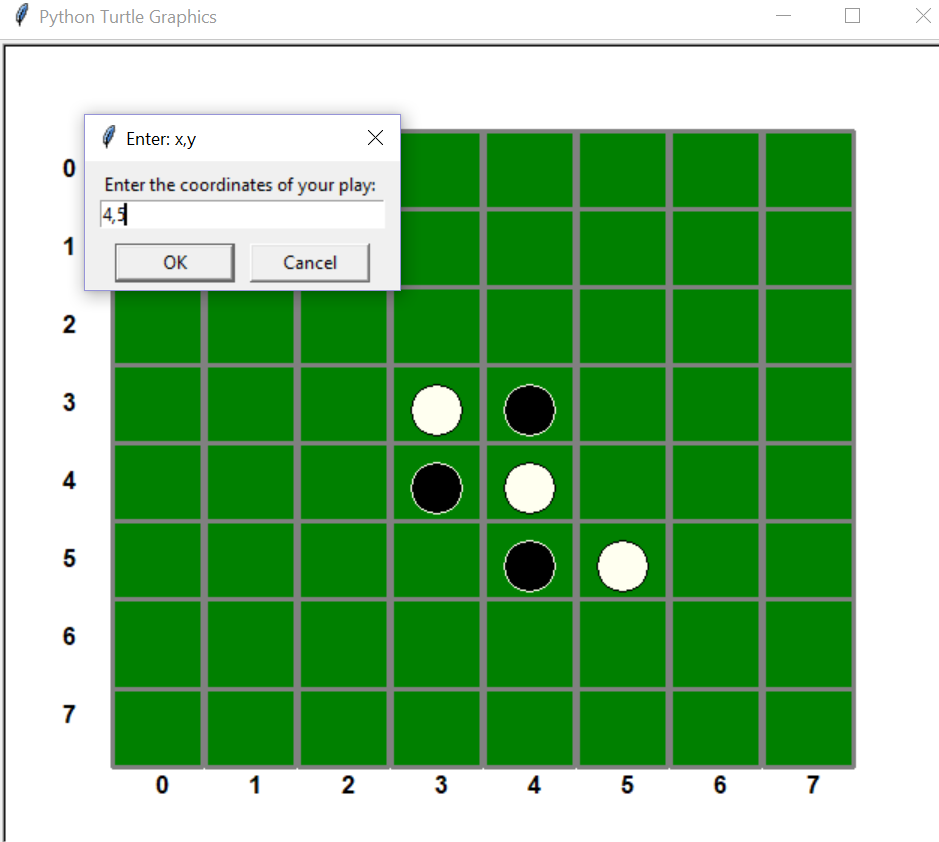
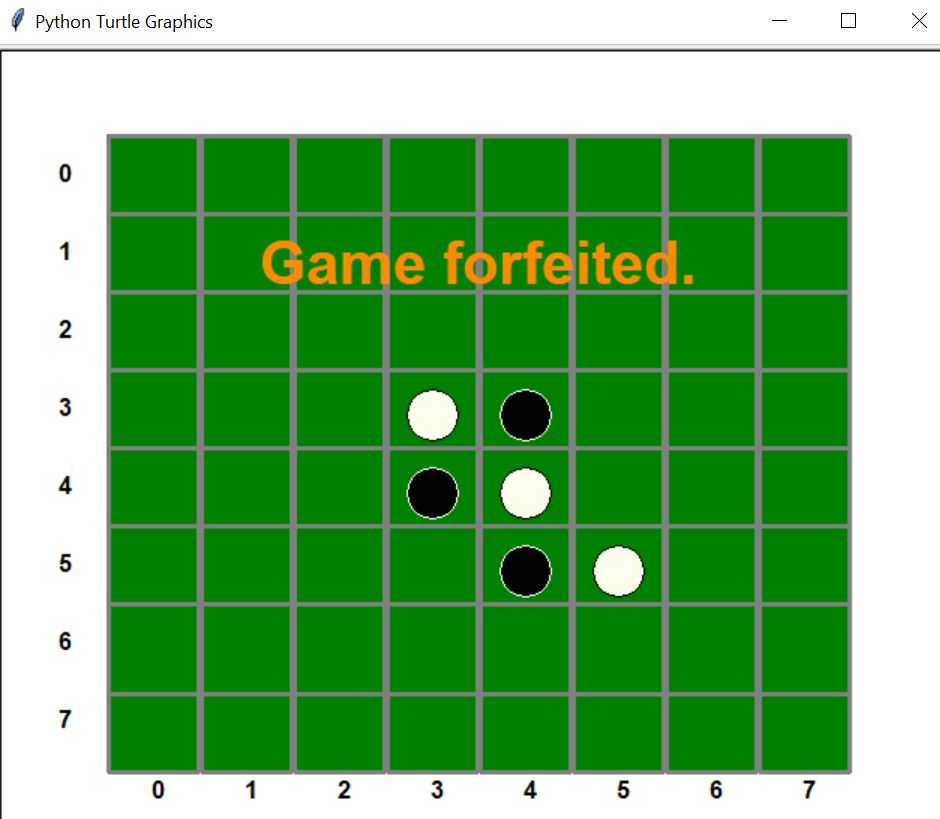

# othello
This project was created as part of a class at the University of Minnesota. This is a re-creation of the board game Othello.

The program starts by setting up the Othello board and asking the player to input the coordinates of their starting play. The player is always black and always goes first.

Once the player enters their coordinates and presses enter, the chips will flip, white will immediately take its turn, and the program will prompt the player for the coordinates of their next turn. 

The player may forfeit at any time by not entering coordinates or by clicking cancel. If the player plays to the end of the game, the ending score will show on the board. Otherwise, the program will show text saying that the game was forfeited.

